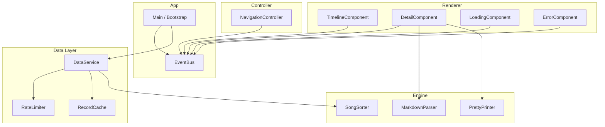
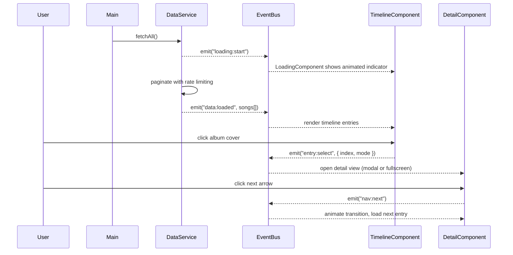
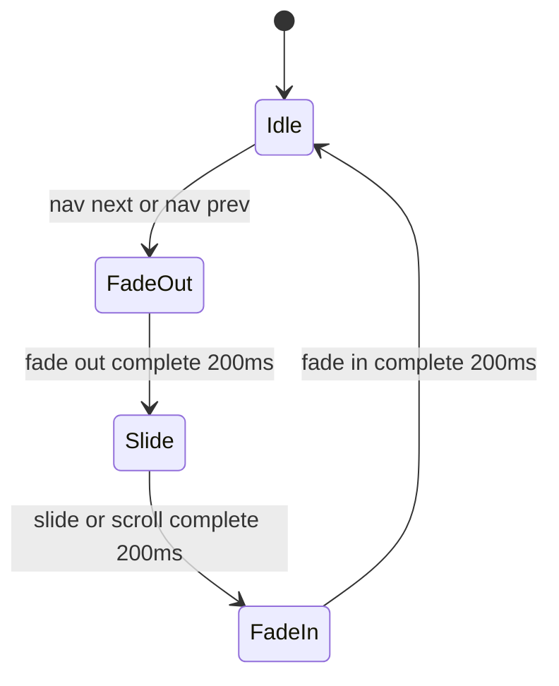

# Design Document: Birthday Playlist

## Overview

"Jeremiah's Birthday Playlist" is a single-page web application that fetches song data from Airtable and renders an interactive chronological timeline (1981–present). Each year maps to one song entry, displayed as an album cover on a horizontal (desktop) or vertical (mobile) timeline. Clicking an entry opens a detail view — a modal on desktop or fullscreen on mobile — with metadata, streaming links, and personal notes.

The architecture follows a strict separation of concerns using vanilla TypeScript with pure DOM manipulation, an EventBus for inter-component communication, and Vite for the build pipeline.

### Key Design Decisions

| Decision | Rationale |
|----------|-----------|
| Custom markdown parser with AST | Requirement 12 mandates round-trip parsing (parse → print → parse = identical output). A custom parser gives us control over the AST and pretty-printer needed for this property. |
| EventBus over direct imports | Decouples components so the Timeline doesn't need to know about the Detail view, enabling independent testing and future changes. |
| Build-time token injection | Keeps the Airtable token out of source control. Vite's `define` or `import.meta.env` replaces the value at build time so it never appears in git history. |
| Rate-limiter as a generic utility | The 5 req/sec constraint is enforced in a reusable module, testable independently of Airtable logic. |
| CSS transitions for animation | The three-phase animation (fade out → slide → fade in) uses CSS transitions orchestrated by JS, keeping frame rates smooth without a library. |
| 768px breakpoint for responsive | Single breakpoint keeps CSS and JS layout logic simple; matches common tablet/phone threshold. |

## Architecture

### Component Diagram



### Data Flow Diagram



### Animation Sequence (Three-Phase Navigation)



**Phase details:**
- **FadeOut**: Opacity 1 to 0 on detail content (heading, artist photo, notes)
- **Slide**: Timeline scrolls to center adjacent album cover
- **FadeIn**: Opacity 0 to 1 on new detail content

## Components and Interfaces

### Types / Models (`src/types.ts`)

```typescript
/** Raw Airtable record shape (fields as returned from API) */
export interface AirtableRecord {
  id: string;
  fields: {
    "Release Date"?: string;      // ISO date string e.g. "1981-06-15"
    "Song"?: string;
    "Artist"?: string;
    "Album"?: string;
    "Artist Photo"?: string;      // URL
    "Apple Music"?: string;       // URL
    "Spotify"?: string;           // URL
    "Album Cover"?: string;       // URL
    "Music Video"?: string;       // URL
    "Thoughts"?: string;          // Markdown text
  };
  createdTime: string;
}

export interface AirtableResponse {
  records: AirtableRecord[];
  offset?: string;
}

/** Runtime domain model after normalization */
export interface SongEntry {
  id: string;
  year: number | null;
  releaseDate: string | null;     // ISO date string
  song: string;
  artist: string;
  album: string;
  artistPhotoUrl: string | null;
  appleMusicUrl: string | null;
  spotifyUrl: string | null;
  albumCoverUrl: string | null;
  musicVideoUrl: string | null;
  thoughts: string | null;        // Raw markdown
}

/** Sorted, validated collection ready for rendering */
export interface SongCollection {
  entries: SongEntry[];
  startYear: number;
  endYear: number;
}
```

### EventBus (`src/event-bus.ts`)

```typescript
export type EventMap = {
  "loading:start": undefined;
  "loading:progress": { fetched: number; total: number | null };
  "data:loaded": { collection: SongCollection };
  "data:error": { message: string };
  "entry:select": { index: number };
  "entry:deselect": undefined;
  "nav:next": undefined;
  "nav:prev": undefined;
  "nav:transition:start": undefined;
  "nav:transition:end": undefined;
  "layout:changed": { mode: "horizontal" | "vertical" };
};

export interface EventBus {
  on<K extends keyof EventMap>(event: K, handler: (payload: EventMap[K]) => void): void;
  off<K extends keyof EventMap>(event: K, handler: (payload: EventMap[K]) => void): void;
  emit<K extends keyof EventMap>(event: K, payload: EventMap[K]): void;
}
```

### DataService (`src/data/data-service.ts`)

```typescript
export interface DataServiceConfig {
  baseId: string;
  tableId: string;
  token: string;
  maxPages: number;         // default 50
  timeoutMs: number;        // default 30000
  rateLimit: number;        // default 5 req/sec
}

export interface DataService {
  fetchAll(): Promise<SongCollection>;
}

export function createDataService(config: DataServiceConfig, bus: EventBus): DataService;
```

### RateLimiter (`src/data/rate-limiter.ts`)

```typescript
export interface RateLimiter {
  /** Waits until a request slot is available, then resolves */
  acquire(): Promise<void>;
}

export function createRateLimiter(maxPerSecond: number): RateLimiter;
```

### SongSorter (`src/engine/song-sorter.ts`)

```typescript
/**
 * Sorts SongEntry[] by releaseDate ascending.
 * Entries with null releaseDate go to end.
 */
export function sortSongs(entries: SongEntry[]): SongEntry[];
```

### MarkdownParser (`src/engine/markdown-parser.ts`)

```typescript
/** AST node types for supported markdown */
export type MdNode =
  | { type: "heading"; level: 1 | 2 | 3 | 4 | 5 | 6; children: MdInline[] }
  | { type: "paragraph"; children: MdInline[] }
  | { type: "unordered-list"; items: MdListItem[] }
  | { type: "ordered-list"; items: MdListItem[] };

export type MdInline =
  | { type: "text"; value: string }
  | { type: "bold"; children: MdInline[] }
  | { type: "italic"; children: MdInline[] }
  | { type: "link"; href: string; children: MdInline[] };

export interface MdListItem {
  children: MdInline[];
}

export interface MarkdownParser {
  /** Parse markdown string into AST */
  parse(source: string): MdNode[];
  /** Render AST to sanitized HTML string */
  toHtml(nodes: MdNode[]): string;
}

export function createMarkdownParser(): MarkdownParser;
```

### PrettyPrinter (`src/engine/pretty-printer.ts`)

```typescript
export interface PrettyPrinter {
  /** Convert AST back to markdown string */
  print(nodes: MdNode[]): string;
}

export function createPrettyPrinter(): PrettyPrinter;
```

### TimelineComponent (`src/renderer/timeline-component.ts`)

```typescript
export interface TimelineComponent {
  mount(container: HTMLElement): void;
  update(collection: SongCollection): void;
  scrollToIndex(index: number): Promise<void>;
  destroy(): void;
}

export function createTimelineComponent(bus: EventBus): TimelineComponent;
```

### DetailComponent (`src/renderer/detail-component.ts`)

```typescript
export interface DetailComponent {
  mount(container: HTMLElement): void;
  open(index: number, collection: SongCollection): void;
  close(): void;
  destroy(): void;
}

export function createDetailComponent(bus: EventBus, parser: MarkdownParser): DetailComponent;
```

### LoadingComponent (`src/renderer/loading-component.ts`)

```typescript
export interface LoadingComponent {
  mount(container: HTMLElement): void;
  show(): void;
  hide(): void;
  destroy(): void;
}

export function createLoadingComponent(bus: EventBus): LoadingComponent;
```

### NavigationController (`src/controller/navigation-controller.ts`)

```typescript
export interface NavigationController {
  init(collection: SongCollection): void;
  getCurrentIndex(): number;
  canGoNext(): boolean;
  canGoPrev(): boolean;
  goNext(): void;
  goPrev(): void;
  destroy(): void;
}

export function createNavigationController(bus: EventBus): NavigationController;
```

## Data Models

### Airtable API JSON Schema

The raw response from `GET https://api.airtable.com/v0/{baseId}/{tableId}`:

```json
{
  "records": [
    {
      "id": "rec...",
      "createdTime": "2024-01-15T10:30:00.000Z",
      "fields": {
        "Release Date": "1981-06-15",
        "Song": "Bette Davis Eyes",
        "Artist": "Kim Carnes",
        "Album": "Mistaken Identity",
        "Artist Photo": "https://example.com/photo.jpg",
        "Apple Music": "https://music.apple.com/...",
        "Spotify": "https://open.spotify.com/...",
        "Album Cover": "https://example.com/cover.jpg",
        "Music Video": "https://youtube.com/...",
        "Thoughts": "## Why this song\n\nThis was the **#1 hit** the year I was born..."
      }
    }
  ],
  "offset": "itr..."
}
```

### Runtime Model Transformation

```
AirtableRecord → normalize() → SongEntry
  - Extract year from "Release Date" (parse ISO, take year)
  - Map field names from space-separated to camelCase
  - Null-coalesce missing fields
  - Validate URLs (basic format check)

SongEntry[] → sortSongs() → SongEntry[] (sorted, nulls at end)

SongEntry[] + metadata → SongCollection
```

### State Model

```typescript
export interface AppState {
  phase: "loading" | "ready" | "error";
  collection: SongCollection | null;
  selectedIndex: number | null;
  isTransitioning: boolean;
  layoutMode: "horizontal" | "vertical";
  errorMessage: string | null;
}
```

## EventBus Events

| Event | Payload | Emitted By | Consumed By |
|-------|---------|------------|-------------|
| `loading:start` | `undefined` | DataService | LoadingComponent |
| `loading:progress` | `{ fetched, total }` | DataService | LoadingComponent |
| `data:loaded` | `{ collection }` | DataService | TimelineComponent, Main |
| `data:error` | `{ message }` | DataService | ErrorComponent |
| `entry:select` | `{ index }` | TimelineComponent | DetailComponent, NavigationController |
| `entry:deselect` | `undefined` | DetailComponent | TimelineComponent |
| `nav:next` | `undefined` | DetailComponent | NavigationController |
| `nav:prev` | `undefined` | DetailComponent | NavigationController |
| `nav:transition:start` | `undefined` | NavigationController | DetailComponent |
| `nav:transition:end` | `undefined` | NavigationController | DetailComponent |
| `layout:changed` | `{ mode }` | Main (resize observer) | TimelineComponent, DetailComponent |


## Correctness Properties

*A property is a characteristic or behavior that should hold true across all valid executions of a system — essentially, a formal statement about what the system should do. Properties serve as the bridge between human-readable specifications and machine-verifiable correctness guarantees.*

### Property 1: Pagination Completeness

*For any* sequence of paginated Airtable responses containing 1–50 pages with varying record counts, the DataService SHALL collect every record from every page and stop fetching when no offset token is present or after 50 pages, whichever comes first.

**Validates: Requirements 1.2**

### Property 2: Rate Limiter Enforcement

*For any* sequence of N acquire() calls to the RateLimiter, no more than 5 calls SHALL resolve within any contiguous 1-second window.

**Validates: Requirements 1.3**

### Property 3: Sort Order Invariant

*For any* array of SongEntry records with arbitrary release dates (including null values), after sorting: (a) all entries with non-null dates SHALL appear before entries with null dates, and (b) entries with non-null dates SHALL be in ascending chronological order.

**Validates: Requirements 1.4**

### Property 4: Timeline Rendering Completeness

*For any* SongCollection, the TimelineComponent SHALL render exactly `collection.entries.length` album cover elements, each paired with a year label matching its entry's year, in the same order as the sorted collection.

**Validates: Requirements 2.1, 2.2**

### Property 5: Detail Heading Format

*For any* SongEntry with a year, song title, and artist, the detail heading SHALL be formatted as `"{year} • {song} • {artist}"` and the secondary line SHALL contain the album name and release date.

**Validates: Requirements 3.3, 3.4**

### Property 6: Streaming Icon Conditional Rendering

*For any* SongEntry, the Apple Music icon SHALL be rendered if and only if the entry has a non-null Apple Music URL, and the Spotify icon SHALL be rendered if and only if the entry has a non-null Spotify URL.

**Validates: Requirements 3.5, 3.7, 6.1, 6.2, 6.4, 6.5**

### Property 7: External Link Safety

*For any* rendered streaming link or markdown-originated anchor element, the link SHALL have `target="_blank"` and `rel="noopener noreferrer"`, and each streaming icon SHALL have an accessible name containing the service name.

**Validates: Requirements 6.3, 6.6, 7.4**

### Property 8: Empty Input Produces Empty Output

*For any* string that is empty or composed entirely of whitespace characters, the MarkdownParser SHALL return an empty string, and the Detail_Component SHALL not render a notes section.

**Validates: Requirements 7.2, 12.5**

### Property 9: Markdown Sanitization

*For any* input string containing `<script>` tags, `on*` event handler attributes, or `javascript:` protocol URLs, the MarkdownParser's HTML output SHALL not contain any executable script content.

**Validates: Requirements 7.3**

### Property 10: Markdown Round-Trip

*For any* valid markdown AST, printing it via the PrettyPrinter and then parsing the result via the MarkdownParser SHALL produce structurally identical HTML output (same element tree with same text content, ignoring whitespace differences).

**Validates: Requirements 12.3, 12.4**

### Property 11: Unsupported Markdown Fallback

*For any* input string that does not match any supported markdown syntax (headings, bold, italic, links, lists), the MarkdownParser SHALL render the content as plain text wrapped in a `<p>` element.

**Validates: Requirements 12.6**

### Property 12: Navigation Transition Guard

*For any* sequence of navigation events emitted while a transition is already in progress, the NavigationController SHALL ignore all subsequent events until the current transition completes — resulting in exactly one transition per burst of rapid events.

**Validates: Requirements 9.7**

### Property 13: Tab Order Matches Chronological Order

*For any* rendered timeline, the keyboard tab order of album cover elements SHALL match the chronological sort order of the SongCollection entries.

**Validates: Requirements 10.1**

### Property 14: Album Cover Size Invariants

*For any* rendered album cover in the timeline, width SHALL equal height (1:1 aspect ratio), and when the viewport is 768px or greater, dimensions SHALL be between 150px and 300px inclusive.

**Validates: Requirements 5.3, 5.5**

## Error Handling

| Error Condition | Detection | User-Facing Behavior | Recovery |
|----------------|-----------|---------------------|----------|
| Airtable API HTTP error (4xx/5xx) | Response status code check | Display "We couldn't load the music data. Please try again later." in content area | Retry button offered; manual page refresh |
| Network timeout (>30s total) | AbortController timeout | Same message as API error | Same as above |
| Missing AIRTABLE_API_TOKEN at build time | Vite plugin checks env var | Build fails with clear error in terminal | Developer must set env var and rebuild |
| Missing token at runtime (empty string) | Guard check before first fetch | Display "Configuration error. Data cannot be loaded." | None — requires rebuild |
| Pagination infinite loop (>50 pages) | Counter check in fetch loop | Renders whatever data was collected up to that point | Partial timeline displayed |
| Album cover image fails to load | `onerror` event on `` | Placeholder with song title text, same dimensions as other covers | No retry — placeholder persists |
| Markdown parse error (malformed syntax) | Try-catch around parser | Render raw text in `<p>` element | Graceful degradation — content still visible |
| Rate limit exceeded (429 response) | Response status 429 check | Pause and retry after 1s (up to 3 retries), then surface error | Automatic retry with backoff |
| Browser doesn't support required APIs | Feature detection at startup | Show basic fallback message | Link to supported browsers |

## Animation / Transition Specification

### Three-Phase Navigation Animation

The navigation transition between entries uses a three-phase sequence totaling 600ms:

```
┌─────────────┐    ┌─────────────┐    ┌─────────────┐
│  Phase 1    │    │  Phase 2    │    │  Phase 3    │
│  FADE OUT   │ →  │  SLIDE      │ →  │  FADE IN    │
│  200ms      │    │  200ms      │    │  200ms      │
└─────────────┘    └─────────────┘    └─────────────┘
```

#### Phase 1: Fade Out (0–200ms)

| Property | From | To | Easing |
|----------|------|-----|--------|
| `opacity` (detail content) | 1 | 0 | `ease-out` |
| Target elements | Heading, secondary line, artist photo, streaming links, notes | | |
| Album cover | Remains visible and stationary | | |

#### Phase 2: Slide / Scroll (200–400ms)

| Context | Action | Easing |
|---------|--------|--------|
| Desktop (horizontal) | `scrollLeft` of timeline container animates to center adjacent album cover | `ease-in-out` |
| Mobile (vertical) | `scrollTop` of page scrolls to vertically center adjacent album cover | `ease-in-out` |
| Implementation | `Element.scrollTo({ behavior: 'smooth' })` with CSS `scroll-behavior`, or manual RAF loop for precise timing |

#### Phase 3: Fade In (400–600ms)

| Property | From | To | Easing |
|----------|------|-----|--------|
| `opacity` (new detail content) | 0 | 1 | `ease-in` |
| Target elements | New heading, secondary line, artist photo, streaming links, notes | | |

#### CSS Implementation

```css
.detail-content {
  transition: opacity 200ms ease-out;
}

.detail-content--fading-out {
  opacity: 0;
}

.detail-content--fading-in {
  opacity: 0;
  transition: opacity 200ms ease-in;
}

.detail-content--visible {
  opacity: 1;
}

.timeline-scroll {
  scroll-behavior: smooth;
  /* Fallback: JS-controlled scroll for precise 200ms timing */
}
```

#### State Machine (JS orchestration)

```typescript
type TransitionPhase = "idle" | "fade-out" | "slide" | "fade-in";

async function navigateToEntry(targetIndex: number): Promise<void> {
  if (currentPhase !== "idle") return; // Guard: ignore during transition

  currentPhase = "fade-out";
  await fadeOut(200);                  // Phase 1

  currentPhase = "slide";
  await scrollToIndex(targetIndex, 200); // Phase 2

  currentPhase = "fade-in";
  updateDetailContent(targetIndex);
  await fadeIn(200);                   // Phase 3

  currentPhase = "idle";
}
```

## Testing Strategy

### Property-Based Testing (fast-check)

The project uses **fast-check** for property-based testing, configured to run a minimum of 100 iterations per property.

Each property test is tagged with a comment referencing its design property:
```typescript
// Feature: birthday-playlist, Property 10: Markdown Round-Trip
```

Properties 1–14 from the Correctness Properties section above will each be implemented as a single `fc.assert(fc.property(...))` test using custom arbitraries for:
- `SongEntry` generation (random strings, dates, optional URLs)
- Markdown AST generation (random valid AST nodes)
- Whitespace string generation
- Rapid event sequence generation

### Unit Tests (Vitest + jsdom)

Unit tests cover:
- Specific examples of correct rendering (detail view content)
- Edge cases (first/last entry navigation boundaries, missing data fields)
- Error handling paths (API errors, timeouts, missing tokens)
- Keyboard interactions (Enter, Space, Escape, Arrow keys)
- Layout breakpoint behavior (768px threshold)
- Animation timing verification
- Accessibility attributes (aria-labels, roles, focus management)

### Integration Tests

- Full data fetch → render pipeline with mocked Airtable responses
- Navigation flow: click entry → view detail → navigate next → close
- Responsive layout switch during active detail view
- Loading state → data loaded transition

### Test Tooling

| Tool | Purpose |
|------|---------|
| Vitest | Test runner and assertion library |
| jsdom | DOM environment for component tests |
| fast-check | Property-based test generation |
| MSW (Mock Service Worker) | Airtable API mocking for integration tests |
